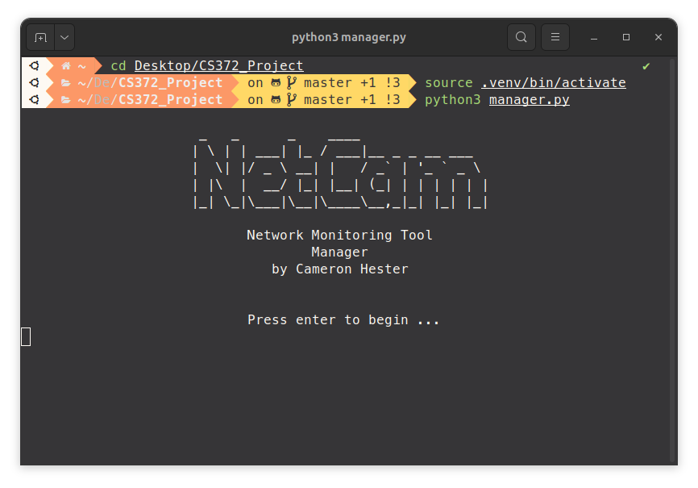

# NetCam



A network monitoring tool for monitoring the status of user-entered servers. Comes with a management side and monitor service side that communicate over TCP. The management side sends task configurations for the monitor service side to carry out. The monitor service will run the tasks automatically, monitoring ICMP, HTTP, HTTPS, NTP, DNS, TCP, and UDP on user-defined intervals.

## Setup

### MacOS/Linux

First, clone the repository or download/extract the files. Then, it is recommended to go to the project directory and create a virtual environment as follows: 

```
python<version> -m venv <name-for-venv>
```

Then, we need to activate the venv by running:

```
source <name-for-venv>/bin/activate
```

Now that the virtual environment is enabled in the terminal, we need to install the packages required by the program that reside in requirements.txt. To do so, we can run the following command:

```
pip install -r requirements.txt
```

To run the program from the monitor service side, we can enter one of the following:

```
sudo python monitor.py
```
```
sudo python3 monitor.py
```
```
sudo <name-for-venv>/bin/python monitor.py
```

To run the program from the management side, we can enter one of the following:

```
python manager.py
```
```
python3 manager.py
```

### Windows

The setup in windows is similar, but we must activate the venv in a different way in project directory:

```
env\Scripts\activate
```

Additionally, Windows does not appear to require the user to use a root access command like sudo to start the application, so the commands in the previous section can be used, just without "sudo".

## Monitor Usage
This section will cover the usage of the monitor service. The monitor mainly just needs to be started up and then once contacted by the manager, we can see information about the processes occurring.

### Startup


After starting up the monitor side of the application, enter the IP address of your device and port you want to use if the software is running remotely, or a loopback address (127.0.0.1) and port if using the software alongside the manager locally. The monitor will then be listening on that IP address and port for connections from the manager.

### ID Setting and Task Startup


After being contacted by the manager, the monitor will receive a unique ID from the manager to set and then the task configurations. Tasks will be started up in separate threads and begin to perform network tests.

### Task Reporting


During normal operation, we can see timestamped messages for performing the different tasks and sending the results back to the manager.


If the manager abruptly goes down, results of network tests will be saved for reconnection by the manager.


Once the manager reconnects, the new connection is sent to the task threads, saved messages are sent, and normal operation resumes.

### Shutdown


Monitor server shutdown can be triggered with a keyboard interrupt (CTRL + C). Socket and thread clean up will occur, and the program will exit.

## Manager Usage


This section will cover usage of the management service. The manager provides the utility to create new task configurations for specific monitors, delete configurations, view the current configurations, collect results from a given monitor service, or collect results from all monitor services.

### Create New Config


Enter 1 for the create new config command in the main menu. Enter IP address and port for the monitor this config will be set up for. Enter as many services as you want to run on that monitor. Auto-completion and tab completion are available. Press enter with an empty input when finished. Follow the on-screen prompts to enter desired parameters for the protocol and a test interval that determines how often the service check is run during automatic monitoring. Press enter to use the default value for any parameters that list a default. The new config is displayed once finished.

### Delete Config


Enter 2 for the delete existing config command in the main menu. Enter the monitor you would like to delete the config for. Auto-completion and tab completion are available. Deletion confirmation will be displayed once finished.

### Display Configs


Enter 3 for the see current configs command in the main menu. The current task configuration for each monitor will be displayed.

### Result Collection - One Monitor


Enter 4 for the collect results from a monitor service command in the main menu. Manager will connect to the monitor (if monitor is running and listening for connections as described earlier). A unique ID made up of the IP and port of the monitor will be sent to the monitor to be set, and then the task configurations will be sent.


The task configurations will be echoed back the manager one at a time to be compared with the expected tasks so that we can be ensured they were received by the monitor correctly.


Timestamped and ID tagged results will begin being received by the manager from the monitor.

### Result Collection - All Monitors


Enter 5 for the collect results from all monitor services command in the main menu. Startup is essentially the same as with one monitor, except the individual steps will occur for each monitor in configs.json.


Timestamped and ID tagged results will begin being received by the manager from all of the monitors. We can distinguish between monitors with the ID tags in the headers.

### Reconnection - Monitor Down


If the monitor / connection to the monitor goes down, the manager will attempt reconnection until the monitor service comes back up. Upon reconnection, the startup process will restart and normal operation may resume.

### Reconnection - Manager Down


If the manager goes down, the monitor will save results until the collection process is started for that monitor on the manager side again. The startup process will differ this time in that the configurations will not be resent. The monitor is already busy performing the tasks, so the monitor just sends the new connection to the task threads as discussed previously. The saved messages are then sent to the manager in bulk and normal operation proceeds.

### Exiting Result Collection


To exit result collection, press CTRL + C. The client threads will be stopped and commands to the monitor servers will be sent to stop the tasks. Sockets are closed and the software returns to the main menu. This doesn't fully shut the monitors down, just puts them back into the state of listening for a connection, so another cycle of result collection can be started again from the main menu for any monitors currently running.

## Included Echo Server

The program is also packaged with a local echo server that can be used for echo testing by the monitors. It is set up on 127.0.0.1 and port 12345, so the server would need to be started up on the monitor device and these parameters would need to be entered for that monitor during config set up on the manager side. The echo testing uses simple generated lorem sentences in this software.
